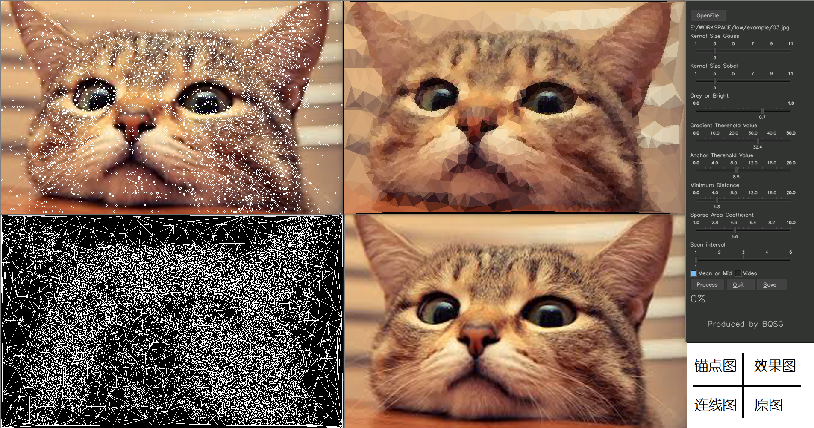
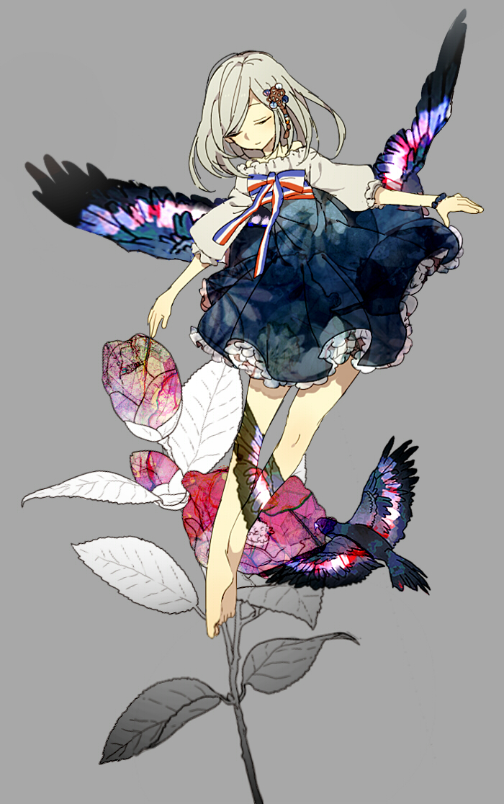
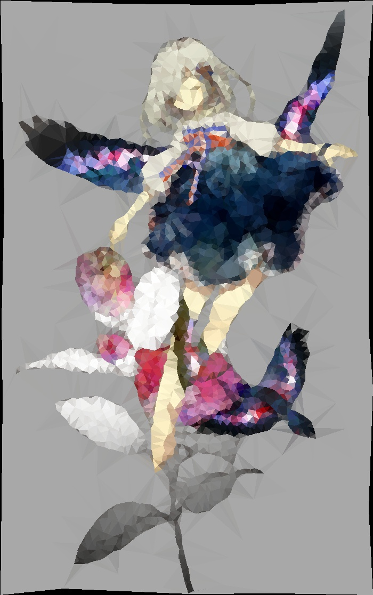
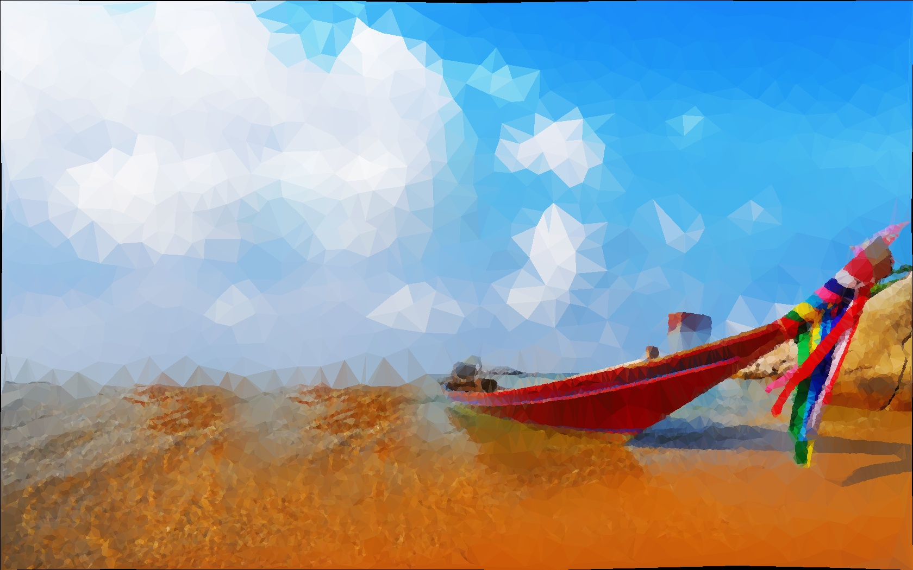
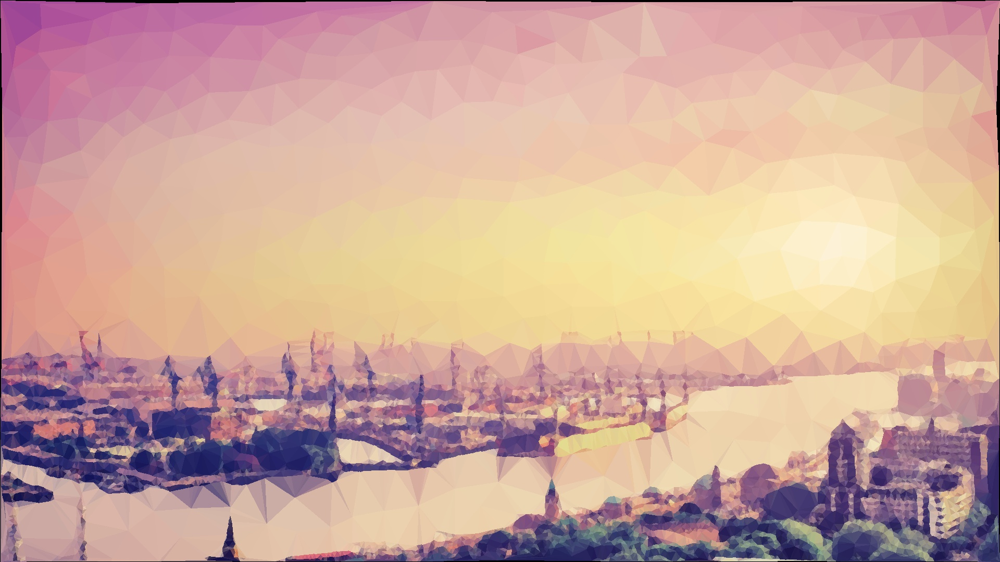
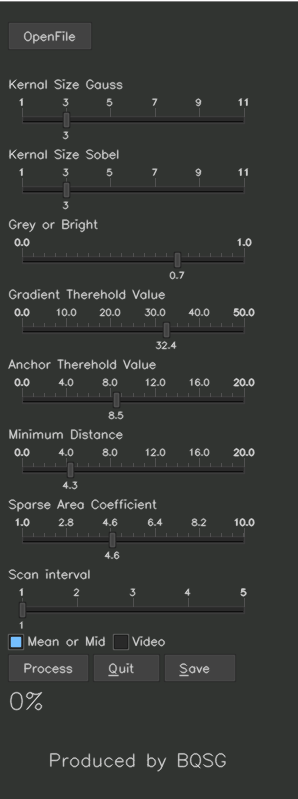

# Low-Poly-Style-Generator 低多边形风格生成器

A Low Poly Style Picture Generator by Python
一个低多边形风格图像的生成器

## 什么是Low Poly

> 继拟物化、扁平化（Flat Design）、长阴影（Long Shadow）之后，低多边形（Low Poly）又火速掀起了最新设计风潮。这种设计风格在早期计算机建模和动效中就被广泛采用，在快要被遗忘之时，突然又流行了一把。Low Poly是一种复古未来派风格设计（它本身也可以称之为新唯美设计The New Aesthetic)，又回到过去，又回到未来，在摇摆不定中寻找美学的平衡。繁荣发展的数字艺术，经历了一代又一代对“逼真”风格的无限追求，可他们永远无法做到逼真，因为他们进行的是模拟，此时，有人厌倦了模拟，他们开始追求抽象化的表达。

简单来说，LowPoly 是一种抽象的艺术风格

## 怎么实现的

### 实现效果

### 降噪

采用高斯模糊的方式降低噪声带来的“增边”

### 寻找点集合

采用了[Edge Drawing](https://www.researchgate.net/publication/220932363_Edge_Drawing_A_Heuristic_Approach_to_Robust_Real-Time_Edge_Detection).算法寻找锚点，随机将锚点插入图中且保证任意两点之间距离不小于某一阈值，最后再图上任意撒点，两点之间不小于另一阈值

### 连边

采用Delaunay三角剖分保证最大角最小，使得整个图较为整齐美观

### 染色

采用两种方法染色：

- 取区域颜色的平均
- 取三端点和重心的颜色的平均

### 效果

***视频***效果请自行下载查看, 用时约2-3min，200帧，吃我罗小黑的安利！！！

## 用法

先安装python和anaconda，友情推荐使用[tuna镜像源](https://mirrors.tuna.tsinghua.edu.cn/)和/或[oh-my-tuna](https://tuna.moe/oh-my-tuna/)
然后conda和pip安装requirement
最后运行main.py如图

- **Open File** :打开文件（按“O”亦可）
- **Kernal Size Gauss** : 高斯模糊矩阵大小，越大噪点越少，但信息丢失越多
- **Kernal Size Sobel** : Sobel算子矩阵大小，越大越灵敏，但容易识别噪点
- **Grey or Bright**: 数值明度所占比例越小，颜色所占比例越大
- **Gradient/Anchor Therehold Value** : 阈值越低，ED算法中灵敏度越高
- **Minium Distance**：两关键点之间的最小距离
- **Sparse Area Coeffient**：非关键点之间的最小距离系数（是关键点的多少倍）
- **Scan Interval**:关键点*扫描*间隔（行/列数）
- **Mean or Mid**:平均还是中点，中点上色较快，平均较为贴近原图
- **Video** : 视频模式（BETA，请自行研究）
- **Process** :开始转换（预览，按P亦可）
- **Quit** :退出（按Q亦可）
- **Save** :存储高清版，可能需要时间计算，